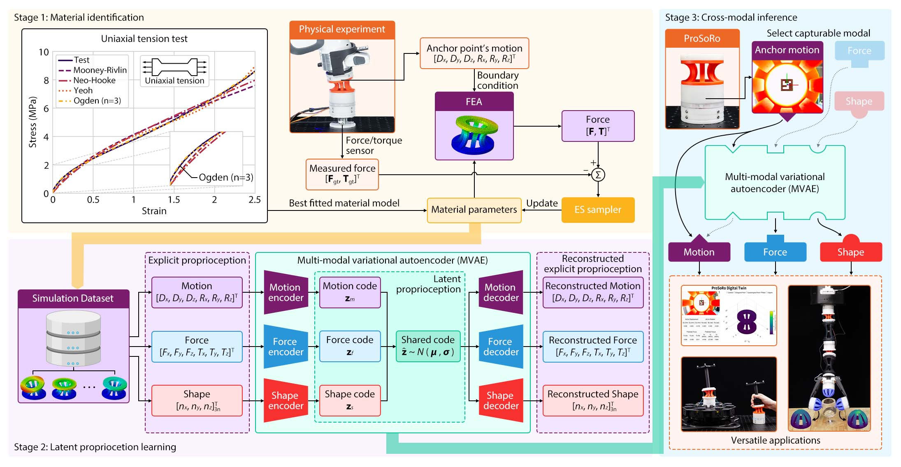
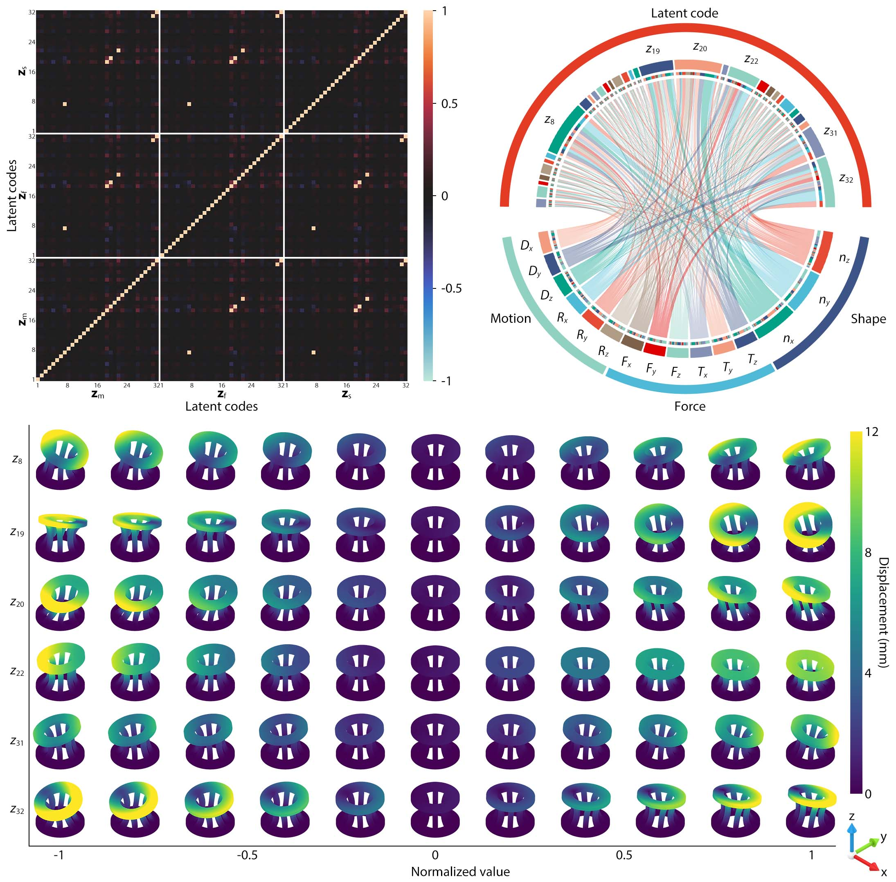
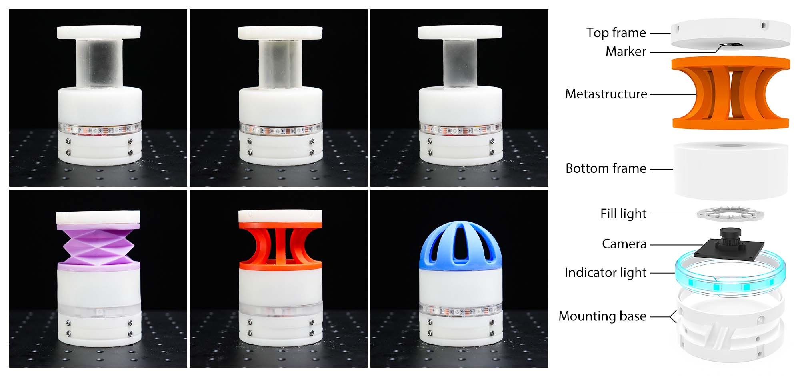

# ProSoRo: Anchoring Morphological Representations Unlocks Latent Proprioception in Soft Robots

<div align="center">
[Xudong Han](https://hanxudong.cc), [Ning Guo](https://gabriel-ning.github.io), [Fang Wan](https://maindl.ancorasir.com), [Wei Zhang](https://www.wzhanglab.site), [Chaoyang Song](https://bionicdl.ancorasir.com)
</br>
Southern University of Science and Technology
</br></br>

</div>

## Overview

**Proprioceptive Soft Robot (ProSoRo)** is a proprioceptive soft robotic system that utilizes miniature vision to track an internal marker within the robot's deformable structure. By monitoring the motion of this single point relative to a fixed boundary, we capture critical information about the robot's overall deformation state, significantly reducing sensing complexity. To process this information, we employ a **multi-modal variational autoencoder (MVAE)** that aligns motion, force, and shape data into a unified latent code, which we term latent proprioception. This framework enables cross-modal inference, allowing us to estimate unobservable modalities such as internal forces and whole-body deformations from easily measured motion data.

<div align="center"></div>

Within this latent code, we identify "key morphing primitives" that correspond to fundamental deformation modes. By systematically varying these latent components, we can generate a spectrum of deformation behaviors, offering a novel perspective on soft robotic systems' intrinsic dimensionality and controllability. This understanding enhances the interpretability of the latent code and facilitates the development of more sophisticated control strategies and advanced human-robot interfaces.

<div align="center"></div>

The training data of MVAE is from finite element analysis (FEA) in Abaqus. To minimize the sim2real gap, we developed **Evolutionary Optimization for Material Identification with Abaqus (EVOMIA)**, which is a method for material parameter identification based on experimental data. Method details can be found in [EVOMIA](https://github.com/ancorasir/EVOMIA).

## Installation

This repository contains the training and testing code for ProSoRo, which are tested on both Ubuntu 22.04 and Windows 11. We recommend creating a new virtual environment, such as `conda`, to install the dependencies:

```bash
conda create -n prosoro python=3.10
conda activate prosoro
```

Then, download the latest release and install the dependencies:

```bash
git clone https://github.com/ancorasir/ProSoRo.git
cd soft-proprioceptive-module
pip install -r requirements.txt
```

And intall `pytorch>=2.1`:

```bash
pip install torch torchvision torchaudio --index-url https://download.pytorch.org/whl/cu118
```

If you want to generate the simulation data, it's necessary to have `Abaqus>=2022` installed on your platform.

## Guideline

Here we provide a [guide](guide.ipynb) to train and test ProSoRo. You can run the notebook in your local environment. Briefly, the guideline includes the following parts:

1. **Simulation Template**: Generate an `.inp` file in Abaqus/CAE as the template.
2. **Pose Data**: Generate a list of poses which are the boundary conditions of `.inp` files.
3. **Batch Simulation**: Generate and submit `.inp` files in batch and read the results.
4. **Data Preprocessing**: Preprocess the simulation results and generate the training data.
5. **Training**: Train a MVAE model with the training data.
6. **Testing**: Test the trained model on the testing data.

It's also available to use the modules provided in `modules/` and test on a real ProSoRo hardware. More details can be found in the [guide](guide.ipynb).

## Hardware

ProSoRo hardware consists of a metastructure, a camera, LED lights and several 3D-printed parts. There are six types of ProSoRos, including cylinder, octagonal prism, quadrangular prism, origami, omni-neck, and dome. All ProSoRos are with similar structure and based on the same vision-based proprioception method. More building details can be found in [hardware guide](https://sites.google.com/view/prosoro-hardware).

<div align="center"></div>

But it's not necessary to have the hardware if you just want to run the code. It's available to train and test in the simulation environment.

## License

This repository is released under the [MIT License](./LICENSE).

## Acknowledgements

- **Pytorch Lightning**: We use [Pytorch Lightning 2.0](https://github.com/Lightning-AI/pytorch-lightning) by [Lightning AI](https://lightning.ai/) as the training framework, and started from the [official docs](https://lightning.ai/docs/pytorch/stable/).
- **Abaqus**: We use [Abaqus 2022](https://www.3ds.com/products-services/simulia/products/abaqus/) as the simulation software, and build up the simulation pipeline and python scripts.
- **Plotly**: We use [Plotly](https://plotly.com) to visualize the results of the model, and build up a interface for ProSoRo using [Dash](https://dash.plotly.com).
