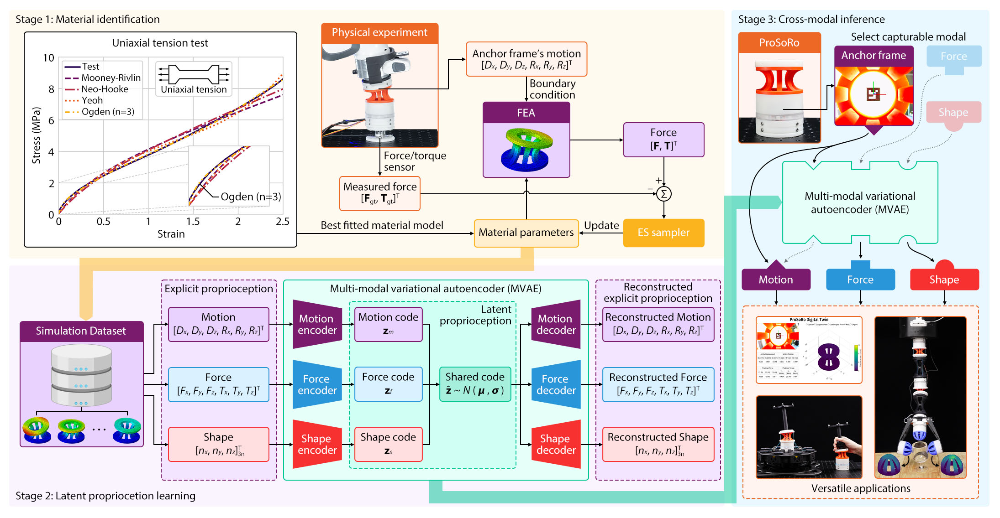
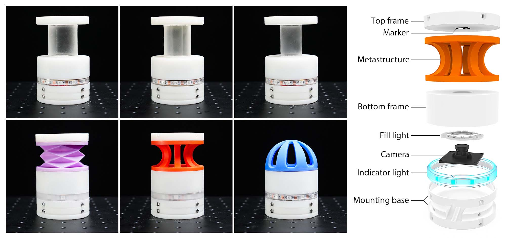

<div align="center">
<h1>Anchoring Morphological Representations Unlocks Latent Proprioception in Soft Robots</h1>
<a href="https://hanxudong.cc">Xudong Han</a><sup>1</sup>, <a href="https://gabriel-ning.github.io">Ning Guo</a><sup>2</sup>, <a href="">Ronghan Xu</a><sup>1</sup>, <a href="https://maindl.ancorasir.com">Fang Wan</a><sup>1</sup>, <a href="https://bionicdl.ancorasir.com">Chaoyang Song</a><sup>1</sup>
</br>
<sup>1</sup> Southern University of Science and Technology, <sup>2</sup> Shanghai Jiao Tong University
</br></br>

</div>

## Overview

**Proprioceptive Soft Robot (ProSoRo)** is a proprioceptive soft robotic system that utilizes miniature vision to track an internal marker within the robot's deformable structure. By monitoring the motion of this single point relative to a fixed boundary, we capture critical information about the robot's overall deformation state, significantly reducing sensing complexity. To harness the full potential of this anchor-based approach, we developed a multi-modal proprioception learning framework utilizing a **multi-modal variational autoencoder (MVAE)** to align motion, force, and shape of ProSoRos into a unified representation based on an anchored observation, involving three stages:



- **Material identification**: Recognizing the impracticality of collecting extensive physical datasets for soft robots, we leveraged finite element analysis (FEA) simulations to generate high-quality training data. We begin by measuring the material's stress-strain curve through the standard uniaxial tension test to obtain the best-fitted material model. Then, we apply an evolution strategy to optimize the material parameters by comparing the calculated force from finite element analysis (FEA) and the measured ground truth from a physical experiment under the same motion of the anchor point. More details can be found in [EVOMIA](https://github.com/ancorasir/EVOMIA).
- **Latent proprioceptive learning**: The simulation dataset was generated using the optimized material parameters and provided motion in $[D_x, D_y, D_z, R_x, R_y, R_z]^\mathrm{T}$, force in $[F_x, F_y, F_z, T_x, T_y, T_z]^\mathrm{T}$, and shape in node displacements of $[n_x, n_y, n_z]_{3n}^\mathrm{T}$ as the training inputs. To learn these modalities for explicit proprioception, we developed a multi-modal variational autoencoder (MVAE) to encode the ProSoRo's proprioception via latent codes. Three modal latent codes are generated through three specific motion, force, and shape encoders, and the shared code contains fused information from all three modalities by minimizing the errors among the three codes. As a result, the shared codes provide explicit proprioception in the latent space, denoted as latent proprioception, which can be used to reconstruct the three modalities using specific decoders for applied interactions.
- **Cross-modal inference**: In real-world deployments, the shape modality, for example, can be estimated from latent proprioception instead of direct measurement, which is usually impossible to achieve in real-time interactions in robotics. At this stage, we visually capture the ProSoRo’s anchor point as MVAE's input to estimate the force and shape modalities based on the latent knowledge learned from simulation data. We found that our proposed latent proprioception framework to be a versatile solution in soft robotic interactions.

Within the latent code, we identify **key morphing primitives** that correspond to fundamental deformation modes. By systematically varying these latent components, we can generate a spectrum of deformation behaviors, offering a novel perspective on soft robotic systems' intrinsic dimensionality and controllability. This understanding enhances the interpretability of the latent code and facilitates the development of more sophisticated control strategies and advanced human-robot interfaces.


## Installation

This repository contains the training and testing code for ProSoRo, which are tested on both Ubuntu 22.04 and Windows 11. We recommend creating a new virtual environment, such as `conda`, to install the dependencies:

```bash
conda create -n prosoro python=3.10
conda activate prosoro
```

Then, download the latest release and install the dependencies:

```bash
git clone https://github.com/ancorasir/ProSoRo.git
cd ProSoRo
pip install -r requirements.txt
```

And intall `pytorch>=2.1`:

```bash
pip install torch torchvision torchaudio --index-url https://download.pytorch.org/whl/cu118
```

If you want to generate the simulation data, it's necessary to have `Abaqus>=2022` installed on your platform.

## Quick Start

Here we provide a [guide](guide.ipynb) to train and test ProSoRo. You can run the notebook in your local environment. Briefly, the guideline includes the following parts:

1. **Simulation Template**: Generate an `.inp` file in Abaqus/CAE as the template.
2. **Pose Data**: Generate a list of poses which are the boundary conditions of `.inp` files.
3. **Batch Simulation**: Generate and submit `.inp` files in batch and read the results.
4. **Data Preprocessing**: Preprocess the simulation results and generate the training data.
5. **Training**: Train a MVAE model with the training data.
6. **Testing**: Test the trained model on the testing data.

It's also available to use the modules provided in `modules/` and test on a real ProSoRo hardware. More details can be found in the [guide](guide.ipynb).

## Hardware

ProSoRo hardware consists of a metastructure, a camera, LED lights and several 3D-printed parts. There are six types of ProSoRos, including cylinder, octagonal prism, quadrangular prism, origami, omni-neck, and dome. All ProSoRos are with similar structure and based on the same vision-based proprioception method. More building details can be found in [Hardware Guide](https://sites.google.com/view/prosoro-hardware).



But it's not necessary to have the hardware if you just want to run the code. It's available to train and test in the simulation environment.

## License

This repository is released under the [MIT License](./LICENSE).

## Acknowledgements

- **Pytorch Lightning**: We use [Pytorch Lightning](https://github.com/Lightning-AI/pytorch-lightning) by [Lightning AI](https://lightning.ai/) as the training framework, and started from the [official docs](https://lightning.ai/docs/pytorch/stable/).
- **Abaqus**: We use [Abaqus 2022](https://www.3ds.com/products-services/simulia/products/abaqus/) as the simulation software, and build up the simulation pipeline and python scripts.
- **Plotly**: We use [Plotly](https://plotly.com) to visualize the results of the model, and build up a interface for ProSoRo using [Dash](https://dash.plotly.com).
